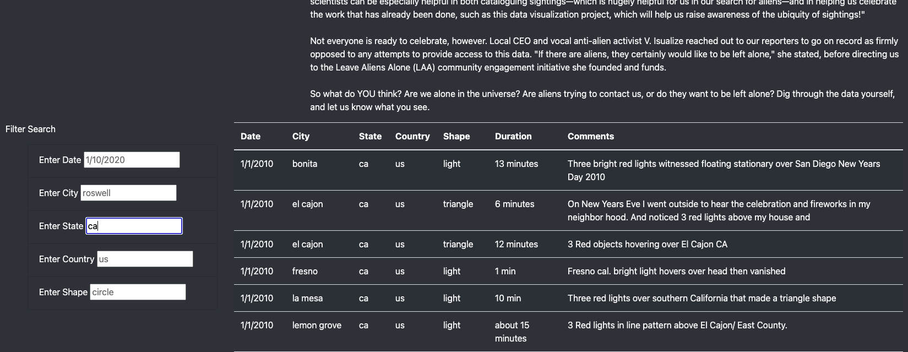
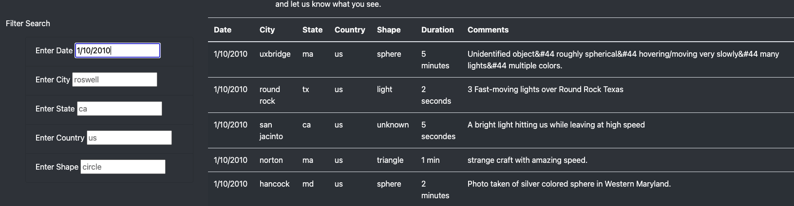
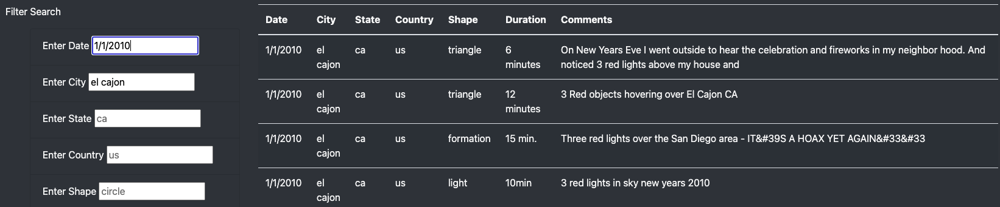

# UFOs

## Overview
The purpose of this analysis is to create a custom and interactive webpage that showcases different UFO sightings around the world. 

## Results
With this new webpage we have added 4 additional search criteria: city, state, country, and shape. To navigate this, the user can enter in one or more of the criteria to filter the results. For example, if you wanted to search for UFO sightings in California you would just need to type "ca" into the state input box and press enter. 
 

If you wanted to look only at sightings on 1/10/2010, you would type 1/10/2010 into the date search box and press enter. 
 

To be more specific you could enter multiple search criteria together. For example, if you wanted to look at only UFO sightings on 1/1/2010 in the city of El Cajon, you would just type 1/1/2010 into the date input box and "el cajon" into the city input box and press enter. 
 

## Summary
In a summary statement, describe one drawback of this new design and two recommendations for further development.
case sensitive?
